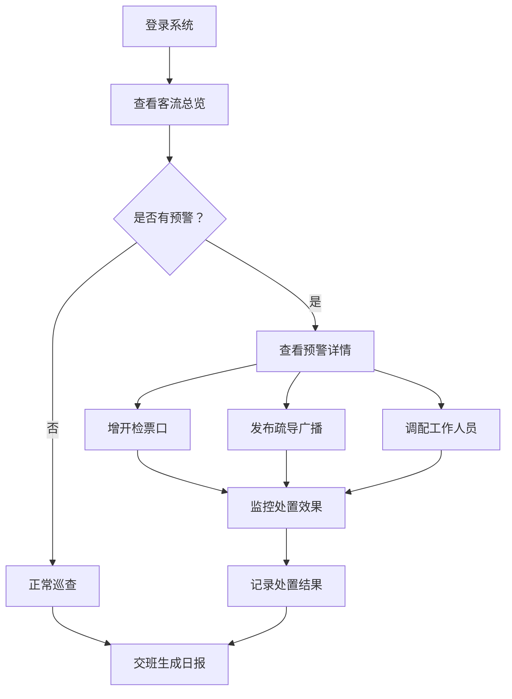
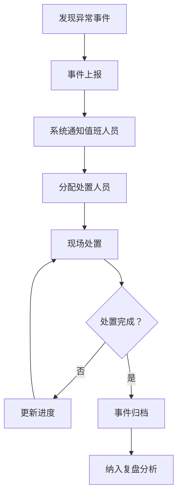

## 1. 产品概述

车站客流组织 Web 应用是面向高铁站值班人员的综合管理平台，用于实时监控、调度和优化车站进出站及候车秩序。通过数据可视化和智能预警，帮助值班人员高效应对客流高峰、处置突发事件、优化人员配置。

- **核心目标**：提升高铁站客流组织效率，降低拥堵风险，改善旅客出行体验
- **目标用户**：高铁站值班站长、客运值班员、现场调度人员
- **产品价值**：实时数据驱动决策，多维度监控覆盖，标准化作业流程

## 2. 核心功能

### 2.1 用户角色

| 角色 | 登录方式 | 核心权限 |
|------|----------|----------|
| 值班站长 | 工号登录 | 全站数据查看、人员调度、事件审批、日报生成 |
| 客运值班员 | 工号登录 | 区域监控、闸机控制、广播发布、事件上报 |
| 现场工作人员 | 工号登录 | 巡查打卡、事件处置、重点旅客服务 |

### 2.2 功能模块

1. **客流总览**：全站客流热力图、实时数据看板、进站峰值预警、多站对比
2. **闸机监测**：闸机运行状态、检票口开闭控制、客流统计、设备异常标注
3. **候车区管理**：候车区容量监控、区域热力分布、重点旅客登记、换乘引导发布
4. **广播通知**：广播模板选择、临时公告推送、播放记录、定时广播设置
5. **人员排班**：工作人员岗位分配、班次管理、巡查打卡记录、人员状态监控
6. **事件记录**：拥堵事件上报、处置进度跟踪、事件分类统计、历史事件查询
7. **复盘分析**：车次客流预测、历史数据对比、日报生成、设备运行分析

### 2.3 页面详情

| 页面名称 | 模块名称 | 功能描述 |
|----------|----------|----------|
| 客流总览 | 客流热力图 | 实时展示全站各区域客流密度热力分布，支持缩放和区域筛选 |
| 客流总览 | 数据看板 | 显示实时进出站人数、在站人数、候车区饱和度等核心指标 |
| 客流总览 | 峰值预警 | 进站客流超阈值时自动预警，显示预测峰值时间和建议措施 |
| 客流总览 | 多站对比 | 支持同时对比多个车站的客流数据和运行指标 |
| 闸机监测 | 闸机状态 | 实时显示所有闸机的运行状态（正常/故障/关闭） |
| 闸机监测 | 检票口控制 | 支持手动开启/关闭检票口，设置自动开关时间 |
| 闸机监测 | 客流统计 | 分检票口统计过闸人数、通过率、平均排队时长 |
| 闸机监测 | 异常标注 | 对设备故障、闸机拥堵等异常进行标注和上报 |
| 候车区管理 | 容量监控 | 显示各候车区实时人数、容量百分比、饱和度预警 |
| 候车区管理 | 区域热力 | 候车区内客流分布热力图，识别密集区域 |
| 候车区管理 | 重点旅客 | 登记老弱病残孕等重点旅客信息，跟踪服务状态 |
| 候车区管理 | 换乘引导 | 发布换乘信息，显示换乘路线和预计时间 |
| 广播通知 | 模板选择 | 内置常用广播模板（检票、晚点、寻人等），支持一键播放 |
| 广播通知 | 临时公告 | 编辑自定义广播内容，选择播放区域和次数 |
| 广播通知 | 播放记录 | 查看历史广播记录，包括内容、时间、播放区域 |
| 广播通知 | 定时广播 | 设置定时广播任务，支持重复周期配置 |
| 人员排班 | 岗位分配 | 可视化拖拽分配工作人员到各岗位 |
| 人员排班 | 班次管理 | 管理早中晚班次，查看人员排班表 |
| 人员排班 | 巡查打卡 | 记录工作人员巡查打卡时间和位置 |
| 人员排班 | 人员状态 | 实时显示在岗/离岗/休息人员状态 |
| 事件记录 | 事件上报 | 上报拥堵、设备故障、旅客纠纷等事件 |
| 事件记录 | 进度跟踪 | 事件处置全流程跟踪，显示当前状态和负责人 |
| 事件记录 | 分类统计 | 按事件类型、严重程度、处理时长统计分析 |
| 事件记录 | 历史查询 | 支持多条件筛选查询历史事件记录 |
| 复盘分析 | 客流预测 | 基于历史数据预测未来车次的客流量 |
| 复盘分析 | 数据对比 | 同比、环比数据对比，生成趋势图表 |
| 复盘分析 | 日报生成 | 一键生成每日运营报告，支持导出 |
| 复盘分析 | 设备分析 | 设备故障率、平均修复时间等运行指标分析 |

## 3. 核心流程

### 3.1 日常值班流程

值班人员登录系统后，首先查看客流总览页面了解全站情况。当系统发出进站峰值预警时，值班人员可通过闸机监测页面增开检票口，通过广播通知页面发布客流疏导信息，同时在人员排班页面调配人员到关键岗位。

### 3.2 事件处置流程

现场发现异常事件后，工作人员通过事件记录模块上报，系统自动通知值班人员。值班人员分配处置人员，跟踪处置进度，事件解决后关闭并归档。

## 4. 用户界面设计

### 4.1 设计风格

- **主色调**：深蓝色 (#0F3460) - 代表专业、可靠、科技感
- **辅助色**：橙色 (#E94560) - 用于预警、重要提示；青色 (#16C79A) - 用于正常状态、成功提示
- **中性色**：深灰 (#1A1A2E)、中灰 (#535461)、浅灰 (#F5F5F5)、白色 (#FFFFFF)
- **按钮风格**：圆角 6px，实心主按钮 + 描边次要按钮，悬停有轻微上浮效果
- **字体**：标题使用思源黑体 Bold，正文使用思源黑体 Regular，数字使用等宽字体
- **布局风格**：卡片式布局，顶部导航 + 左侧菜单 + 主内容区
- **图标风格**：线性图标，统一 24px 尺寸，配色与主题一致

### 4.2 页面设计概述

| 页面名称 | 模块名称 | UI 元素 |
|----------|----------|---------|
| 客流总览 | 客流热力图 | 全屏交互式地图，颜色渐变表示客流密度，支持时间轴回放 |
| 客流总览 | 数据看板 | 大字号数字卡片，带趋势箭头和环比百分比，关键指标高亮 |
| 客流总览 | 峰值预警 | 醒目的预警横幅，红橙黄三色分级，倒计时显示预计峰值 |
| 客流总览 | 多站对比 | 并排数据卡片，支持拖拽排序，差异数据高亮显示 |
| 闸机监测 | 闸机状态 | 栅格布局的设备卡片，绿色正常/红色故障/灰色关闭 |
| 闸机监测 | 检票口控制 | 开关控件，支持批量操作，操作前二次确认 |
| 闸机监测 | 客流统计 | 柱状图 + 折线图组合，支持时间范围选择 |
| 候车区管理 | 容量监控 | 环形进度条显示饱和度，超过阈值变色闪烁 |
| 候车区管理 | 重点旅客 | 列表卡片，标记特殊需求，状态标签醒目 |
| 广播通知 | 模板选择 | 分类标签页，卡片式模板展示，一键播放按钮 |
| 广播通知 | 播放记录 | 时间线布局，显示播放状态和操作人 |
| 人员排班 | 岗位分配 | 拖拽式排班表，颜色区分岗位类型 |
| 人员排班 | 巡查打卡 | 地图标记打卡点，连线显示巡查轨迹 |
| 事件记录 | 事件列表 | 标签分类，严重程度颜色标记，处理进度条 |
| 复盘分析 | 客流预测 | 折线图预测走势，置信区间阴影显示 |
| 复盘分析 | 日报生成 | 预览 + 导出按钮，支持多种格式 |

### 4.3 响应式设计

- **设计原则**：桌面优先，适配 1920×1080 及以上分辨率
- **平板适配**：左侧菜单可收起，卡片自动换行
- **交互优化**：关键操作按钮尺寸不小于 44×44px，支持触屏操作
- **数据可视化**：图表支持手势缩放和平移

### 4.4 动效设计

- **页面加载**：顶部进度条 + 内容淡入，模块按序出现
- **数据更新**：数字滚动动画，卡片轻微闪烁提示新数据
- **预警提示**：脉冲动画 + 顶部滑入通知
- **操作反馈**：按钮点击波纹效果，表单提交成功打勾动画
- **图表交互**：悬停数据点放大，高亮相关数据系列
