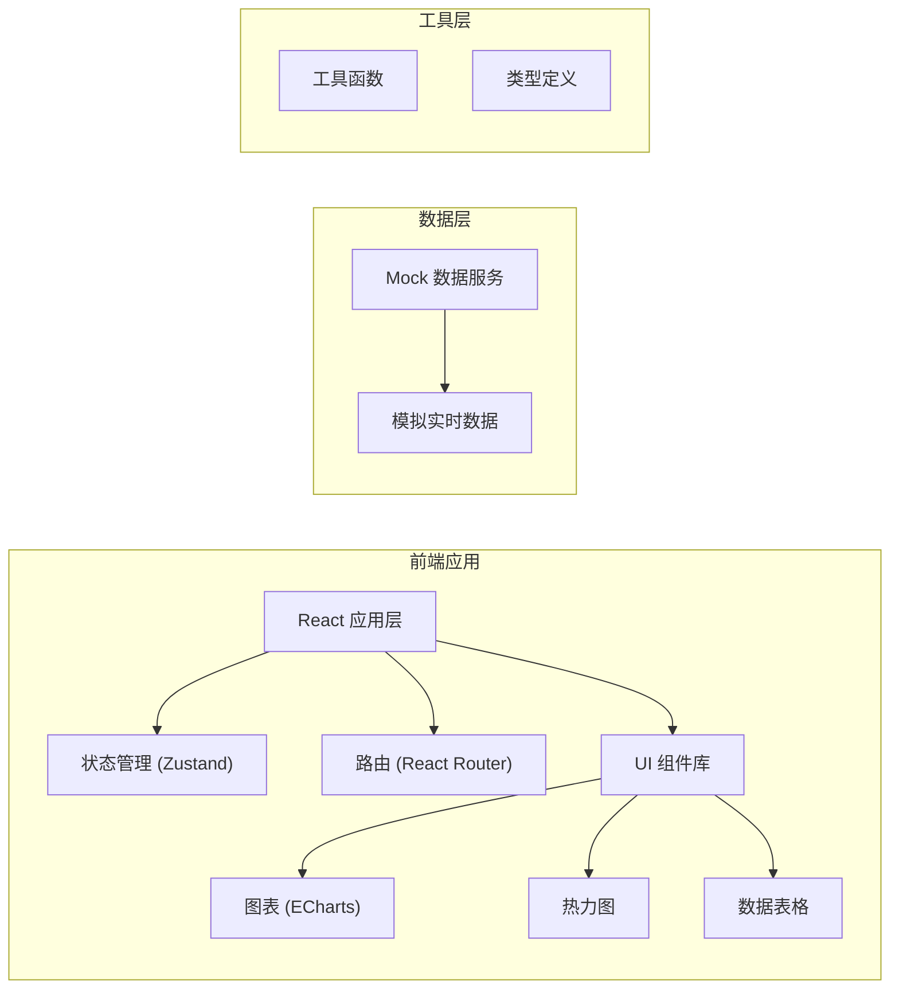

## 1. 架构设计



## 2. 技术栈说明

- **前端框架**：React@18 + TypeScript
- **构建工具**：Vite@5
- **样式方案**：TailwindCSS@3
- **路由管理**：react-router-dom@6
- **状态管理**：zustand@4
- **图表库**：echarts@5
- **图标库**：lucide-react
- **日期处理**：date-fns
- **后端服务**：无（使用 Mock 数据模拟）

## 3. 路由定义

| 路由 | 页面 | 说明 |
|------|------|------|
| / | 客流总览 | 默认首页，展示全站客流概况 |
| /gate-monitor | 闸机监测 | 闸机状态监控和检票口控制 |
| /waiting-area | 候车区管理 | 候车区容量监控和旅客服务 |
| /broadcast | 广播通知 | 广播管理和公告发布 |
| /staff-scheduling | 人员排班 | 工作人员排班和考勤 |
| /event-log | 事件记录 | 事件上报和处置跟踪 |
| /analysis | 复盘分析 | 数据分析和报表生成 |

## 4. 目录结构

```
src/
├── assets/              # 静态资源
│   └── styles/          # 全局样式
├── components/          # 公共组件
│   ├── layout/          # 布局组件
│   ├── ui/              # 基础 UI 组件
│   └── charts/          # 图表组件
├── pages/               # 页面组件
│   ├── Dashboard/       # 客流总览
│   ├── GateMonitor/     # 闸机监测
│   ├── WaitingArea/     # 候车区管理
│   ├── Broadcast/       # 广播通知
│   ├── StaffScheduling/ # 人员排班
│   ├── EventLog/        # 事件记录
│   └── Analysis/        # 复盘分析
├── store/               # 状态管理
├── types/               # TypeScript 类型定义
├── utils/               # 工具函数
├── mock/                # Mock 数据
├── App.tsx
├── main.tsx
└── router.tsx
```

## 5. 数据模型

### 5.1 核心数据类型

```typescript
// 客流数据
interface PassengerFlow {
  id: string;
  timestamp: Date;
  inCount: number;
  outCount: number;
  inStation: number;
  areaDistribution: Record<string, number>;
}

// 闸机设备
interface GateDevice {
  id: string;
  name: string;
  status: 'normal' | 'fault' | 'closed';
  passengerCount: number;
  queueLength: number;
  checkPointId: string;
}

// 检票口
interface CheckPoint {
  id: string;
  name: string;
  status: 'open' | 'closed';
  gateCount: number;
  trainNumber?: string;
  departureTime?: Date;
}

// 候车区
interface WaitingArea {
  id: string;
  name: string;
  capacity: number;
  current: number;
  saturation: number;
  heatmapData: number[][];
}

// 重点旅客
interface SpecialPassenger {
  id: string;
  name: string;
  type: 'elderly' | 'disabled' | 'pregnant' | 'child' | 'other';
  contact?: string;
  trainNumber: string;
  seatNumber?: string;
  status: 'waiting' | 'boarding' | 'completed';
  notes?: string;
  createTime: Date;
}

// 广播模板
interface BroadcastTemplate {
  id: string;
  name: string;
  category: 'checkin' | 'delay' | 'notice' | 'paging' | 'emergency';
  content: string;
}

// 广播记录
interface BroadcastRecord {
  id: string;
  templateId?: string;
  content: string;
  area: string[];
  operator: string;
  playTime: Date;
  status: 'playing' | 'completed' | 'failed';
}

// 工作人员
interface Staff {
  id: string;
  name: string;
  position: string;
  phone: string;
  status: 'on_duty' | 'off_duty' | 'rest';
  currentPost?: string;
}

// 排班记录
interface Schedule {
  id: string;
  staffId: string;
  date: Date;
  shift: 'morning' | 'afternoon' | 'night';
  post: string;
}

// 巡查打卡
interface PatrolRecord {
  id: string;
  staffId: string;
  checkpoint: string;
  timestamp: Date;
  location: { lat: number; lng: number };
}

// 事件记录
interface Event {
  id: string;
  title: string;
  type: 'congestion' | 'equipment' | 'passenger' | 'security' | 'other';
  severity: 'low' | 'medium' | 'high' | 'critical';
  location: string;
  description: string;
  reporter: string;
  reportTime: Date;
  handler?: string;
  status: 'pending' | 'processing' | 'resolved' | 'closed';
  progress: number;
  updates: EventUpdate[];
}

interface EventUpdate {
  id: string;
  eventId: string;
  content: string;
  operator: string;
  timestamp: Date;
}

// 车次预测
interface TrainForecast {
  trainNumber: string;
  departureTime: Date;
  checkPoint: string;
  forecastPassengers: number;
  confidence: number;
}

// 日报数据
interface DailyReport {
  date: Date;
  totalIn: number;
  totalOut: number;
  peakInHour: number;
  peakInCount: number;
  events: number;
  resolvedEvents: number;
  equipmentFaults: number;
  avgRepairTime: number;
}
```

## 6. 状态管理设计

### 6.1 全局状态

```typescript
interface AppState {
  // 当前用户
  currentUser: {
    id: string;
    name: string;
    role: string;
  } | null;
  
  // 实时数据
  realtimeData: {
    passengerFlow: PassengerFlow | null;
    gateDevices: GateDevice[];
    waitingAreas: WaitingArea[];
    activeEvents: Event[];
    onDutyStaff: Staff[];
  };
  
  // UI 状态
  sidebarCollapsed: boolean;
  theme: 'light' | 'dark';
  
  // 方法
  updateRealtimeData: () => void;
  toggleSidebar: () => void;
  setTheme: (theme: 'light' | 'dark') => void;
}
```

## 7. 性能优化

- **代码分割**：按路由进行代码分割，懒加载页面组件
- **数据缓存**：使用 React Query 缓存 API 请求（Mock 数据层模拟）
- **图表优化**：ECharts 启用大数据模式，合理配置数据刷新频率
- **虚拟滚动**：长列表使用虚拟滚动优化渲染性能
- **防抖节流**：搜索、滚动等高频操作使用防抖节流
